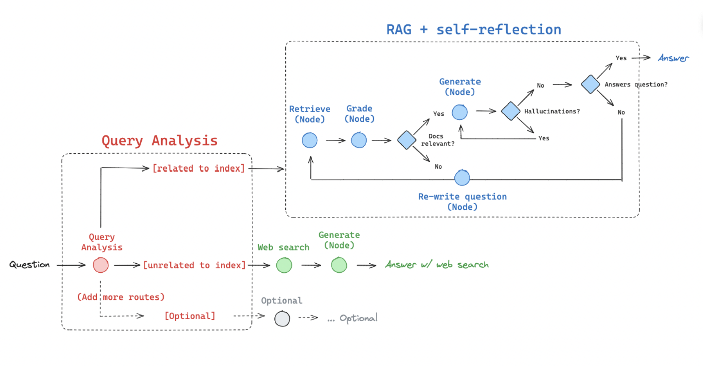
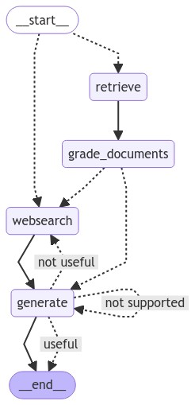

## RAG + Self-Reflection

This project implements Retrieval-Augmented Generation (RAG) enhanced with a self-reflection loop. The goal is to improve the accuracy, relevance, and reliability of answers generated by Large Language Models (LLMs).

<p align="center">
  
</p>

---


### Concept

#### 1- Query Analysis

	•	Incoming questions are analyzed.
	•	If related to the index, the query goes through the RAG pipeline.
	•	If unrelated, it is routed to web search or other external sources.

#### 2-	RAG + Self-Reflection Loop

    •	Retrieve: Fetch relevant documents from the index.
	•	Grade: Check whether the retrieved documents are relevant.
	•	Generate: Produce an answer using the retrieved context.
	•	Self-Reflection:
        •	Check for hallucinations (unsupported claims).
        •	Evaluate if the answer actually addresses the question.
	•	If the answer fails validation, the question is re-written and the loop restarts.

#### 3- Web Search (optional route)

	•	If the query is not related to the index, it is sent to web search.
	•	The LLM then generates an answer using the web results.


<div align="center">



</div>

---

### Features
	•	Automatic query routing to index or web search.
	•	Hallucination detection to validate grounding in documents.
	•	Self-reflection loop to ensure high-quality answers.
	•	Optional web search for out-of-domain queries.

--- 

### Usage

#### 1- Create and activate a virtual environment

```bash
python -m venv venv # create
source venv/bin/activate # activate
```

#### 2- Install dependencies

```bash
pip install -r requirements.txt
```

#### 3- Create a .env file in the project root to store your API keys (for example OpenAI, Tavily, or other providers):

```.env
OPENAI_API_KEY=your_openai_api_key_here
TAVILY_API_KEY=your_tavily_api_key_here
USER_AGENT=your_app_name_here
```

#### 4- Run the pipeline

```bash
python main.py
```

#### 5- Example: (change the question in main.py)
```bash
print(app.invoke({"question": "What is agent memory?"})
```